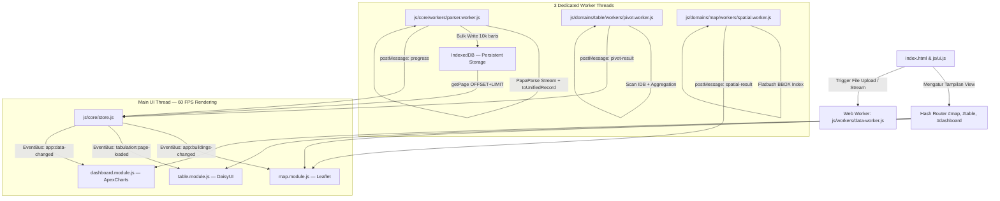

# Arsitektur Sistem: Xplore 3571

Dokumen ini mendefinisikan arsitektur teknis, pola desain, aliran data, dan struktur navigasi untuk aplikasi **Xplore 3571**—sebuah PWA GIS murni *client-side* berbasis Single Page Application (SPA).

---

## 1. Desain Arsitektur Utama (Client-Side SPA)

### 1.1 Platform Deployment: GitHub Pages

Aplikasi dideploy pada **GitHub Pages** (Hosting Statis) tanpa server backend.

| Aspek | Detail |
|---|---|
| **URL** | `https://<username>.github.io/xplore-3571/` |
| **Branch** | `gh-pages` atau root `/` dari branch `main` |
| **HTTPS** | Otomatis oleh GitHub (wajib untuk PWA & Service Worker) |
| **Batasan** | Hanya aset statis (HTML/CSS/JS/file). Tidak bisa menjalankan server-side code |
| **404 SPA** | Perlu file `404.html` yang meredirect ke `index.html` agar hash-router berfungsi saat hard refresh |
| **Cache CDN** | GitHub Pages menggunakan CDN global — aset statis di-serve sangat cepat |

> ⚠️ **Batasan CORS:** Fetch ke URL eksternal (misal GitHub Releases untuk file Parquet) harus mendukung CORS header. GitHub Releases dan raw.githubusercontent.com sudah mendukung CORS secara native.

### 1.2 Dua Mode Sumber Data

Aplikasi mendukung dua mode sumber data yang dapat berjalan bersamaan:

| Mode | Sumber | Teknologi | Status |
|---|---|---|---|
| **Offline / Upload** | File lokal user (CSV, GeoJSON) | Web Worker + IndexedDB | Existing |
| **Online / Remote** | File Parquet terenkripsi di GitHub Releases | DuckDB-WASM + AES-256 | [BARU] |

### Diagram Arsitektur Komponen (Multithreaded & IndexedDB-Centric SPA):


### Prinsip Utama Arsitektur Orchestrator:
> **`js/domains/*/**.module.js`** **HANYA BERPERAN SEBAGAI ORKESTRATOR DOMAIN.**
> Modul domain dilarang berisi fungsi pembantu matematika murni atau manipulasi DOM langsung. Seluruh logika murni dipisahkan ke `js/helpers/` (SRP & DRY), dan komponen UI atomik dipisahkan ke `js/ui/components/`.
>
> **`js/core/listenerManager.js`** adalah **satu-satunya titik registrasi** untuk seluruh global `document.addEventListener()` aplikasi.
> **`js/core/listeners/`** adalah tempat seluruh EventBus subscriber handler — bukan di `helpers/`.
> Tidak ada module-level event listener yang boleh ditulis langsung di dalam orkestrator manapun.

---

### 1.3 Pola Arsitektur: Monolith Modular DDS-Lite

**DDS-Lite** (Domain-Driven Structure Lite) adalah adaptasi pragmatis DDD untuk Vanilla JS client-side murni — tanpa Bounded Context enterprise, tanpa Repository Pattern kompleks. Kode diorganisir berdasarkan **domain bisnis GIS**, bukan berdasarkan layer teknis semata.

#### Layer Stack (dari atas ke bawah):

```
┌─────────────────────────────────────────────────────┐
│  VENDOR LAYER       assets/vendor/                  │  Leaflet, DaisyUI, ApexCharts, DuckDB-WASM
├─────────────────────────────────────────────────────┤
│  TEMPLATE LAYER     templates/                      │  HTML Partials (Markup statis, no logic)
├─────────────────────────────────────────────────────┤
│  CONTROLLER LAYER   js/ui/                          │  DOM Controllers & Atomic UI Components
├─────────────────────────────────────────────────────┤
│  DOMAIN LAYER       js/domains/                     │  Business Domain Orchestrators + Workers
├─────────────────────────────────────────────────────┤
│  STRATEGY LAYER     js/strategies/                  │  Data Parser Interface + Implementations
├─────────────────────────────────────────────────────┤
│  CORE LAYER         js/core/                        │  State, EventBus, Registry, Listeners
├─────────────────────────────────────────────────────┤
│  REPOSITORY LAYER   js/core/services/               │  IndexedDB, LocalStorage, DuckDB-WASM
├─────────────────────────────────────────────────────┤
│  UTILITY LAYER      js/helpers/                     │  Pure Math & Format Functions (no side effects)
├─────────────────────────────────────────────────────┤
│  BROWSER API        IndexedDB · LocalStorage · GEO  │  Native Browser
└─────────────────────────────────────────────────────┘
```

#### Aturan Dependency (Arah Import yang Diizinkan):

| Layer | Boleh Import Dari | Dilarang Import Dari |
|---|---|---|
| `domains/*` | `core/`, `helpers/`, `strategies/` | Sesama `domains/` lain (harus via EventBus) |
| `ui/*` | `core/event-bus.js`, `helpers/formatters.js` | `domains/` langsung |
| `strategies/*` | `helpers/` | `core/`, `domains/`, `ui/` |
| `core/listeners/` | `core/event-bus.js`, `domains/*` | `ui/` |
| `helpers/` | Sesama `helpers/` | Semua layer lain |
| `router.js` | `core/event-bus.js` | `domains/`, `ui/` |

> **Posisi `router.js` di Layer Stack:** `router.js` berada di `js/core/` sebagai infrastruktur navigasi. Modul domain **tidak boleh mengimport `router.js` langsung** — navigasi antar-view dilakukan via `EventBus.emit('router:navigate', { hash })` yang disubscribe oleh router.

> **Aturan Emas:** Komunikasi lintas domain **wajib via `EventBus.emit()`** — tidak boleh ada cross-domain `import` langsung antar `domains/*`.

#### Prinsip Pengembangan (SRP · DRY · Extensibility):

- **SRP:** Setiap file punya satu tanggung jawab. `map.module.js` hanya orkestrator peta — math spasial ada di `helpers/spatial-filter.js`, render marker ada di `building-layer-manager.js`.
- **DRY:** Fungsi yang dipakai 2+ modul **wajib** naik ke `helpers/` atau `core/`. Tidak boleh ada duplikasi logic antar domain.
- **Extensibility:** Menambah domain baru = buat folder baru di `domains/` + daftarkan di `moduleRegistry.js`. Tidak ada file lain yang perlu diubah.
- **Worker per Domain:** Setiap domain boleh punya worker sendiri di `domains/*/workers/`. Worker hanya boleh diinstansiasi oleh module domain-nya sendiri.

---

## 2. Struktur Berkas (File Structure)

### LAMA
```text
xplore-3571/
│
├── index.html              # Entry point utama, kontainer layout (SPA Views) & CDN Loader
├── manifest.json           # Konfigurasi PWA (Web App Manifest)
├── sw.js                   # Service Worker (Caching offline aset inti)
│
├── components/             # HTML Templates (Termasuk Navbar & Sidebar Drawer)
│   ├── navbar.html
│   ├── sidebar.html
│   └── table-drawer.html   # Drawer tabulasi yang muncul di halaman spasial
│
└── js/
    ├── app.js              # Inisialisasi awal aplikasi & PWA Service Worker
    ├── router.js           # Hash-based router untuk navigasi antar-view
    ├── store.js            # [ORKESTRATOR] Data State Orchestrator
    ├── db.js               # IndexedDB Storage Helper (PWA Offline Caching)
    ├── map.js              # [ORKESTRATOR] GIS Map Canvas Orchestrator
    ├── table.js            # [ORKESTRATOR] DaisyUI Table View Orchestrator
    ├── dashboard.js        # [ORKESTRATOR] Dashboard View Orchestrator
    ├── ui.js               # [ORKESTRATOR] General UI Event Orchestrator
    ├── moduleRegistry.js   # Registry untuk mendaftarkan handler titik bangunan, polygon wilayah, data tabulasi
    ├── listenerManager.js  # [ORKESTRATOR] Titik registrasi tunggal semua global event listener
    │
    ├── helpers/            # Helper Fungsi Murni (Pure Logic & Math) - DRY & SRP
    │   ├── pivot.js                 # Engine kalkulasi pivot table (COUNT, SUM, AVG, MIN, MAX)
    │   ├── spatial-filter.js        # Math engine Ray-Casting & Fast Bounding Box Pruning
    │   ├── formatters.js            # Helper format angka, teks, dan sanitasi data
    │   ├── resetSpatialFilter.js    # Helper reset DOM dropdown filter wilayah
    │   ├── SpatialFilterManager.js  # Class filter spasial dinamis berbasis konfigurasi hierarki
    │   ├── building-layer-manager.js # Helper manajemen layer titik bangunan Leaflet
    │   ├── filter-index.js          # Helper pembangunan dan pencarian pohon indeks filter wilayah
    │   └── listeners/               # Domain-specific event listener helpers
    │       ├── mapListener.js       # Handler: app:polygon-changed, app:buildings-changed, explore:flyto
    │       └── storeListener.js     # Handler: store:loading, store:toast
    │
    ├── workers/            # Dedicated Web Workers untuk background data processing
    │   └── data-worker.js  # Dedicated Worker: Pure Parsing CSV/GeoJSON → raw data ke Main Thread
    │
    ├── components/         # Komponen UI JS Modular (Modal, Toast & Builders)
    │   ├── toast.js        # Toast notifikasi & loading indicator
    │   ├── modal.js        # Modal upload spatial file
    │   ├── pivot-modal.js  # Modal builder custom pivot table
    │   ├── search.js       # Komponen pencarian titik bangunan lintas layer
    │   └── confirm-modal.js # Modal konfirmasi update/overwrite data
    │
    └── data-modules/       # Strategy Pattern Handler berbasis OOP Class
        ├── BaseModule.js   # OOP Base Class untuk seluruh data-module
        ├── template-tabulasi.js
        ├── wilkerstat-se2026.js
        ├── fasih-se2026.js
        ├── sentra-ekonomi.js
        └── usaha-suplemen.js
```

### BARU — Monolith Modular DDS-Lite
```text
xplore-3571/
├── index.html                          # App Shell Layout & CDN Entry Point
├── manifest.json                       # PWA Installation Manifest
├── sw.js                               # Service Worker (Cache-First, Offline Manager)
│
├── css/
│   └── style.css                       # Custom overrides & full-height map canvas
│
├── templates/                          # ── HTML PARTIALS (Markup Layer, no logic) ──
│   ├── navbar.html                     # Top navigation bar markup
│   ├── sidebar.html                    # Filter sidebar markup
│   └── table-drawer.html              # Floating table drawer markup
│
├── assets/
│   ├── icons/                          # PWA icons (192px, 512px)
│   ├── markers/                        # Custom SVG/PNG map markers
│   └── vendor/                         # Local CDN copies (offline-safe, cached by SW)
│       ├── daisyui.css                 # DaisyUI v5
│       ├── tailwind.js                 # @tailwindcss/browser v4
│       ├── leaflet.js                  # Leaflet.js v1.9.4
│       ├── leaflet.css
│       ├── apexcharts.js               # ApexCharts.js v6
│       └── duckdb-wasm/
│           ├── duckdb-wasm.js
│           └── duckdb.wasm
│
└── js/
    ├── app.js                          # Bootstrapper & SW Registration
    ├── config.js                       # Environment constants, Tile URLs, IDB quota
    ├── router.js                       # Hash-based SPA Router (#map, #table, #dashboard)
    │
    ├── core/                           # ── MONOLITH CORE (Domain-Agnostic Infrastructure) ──
    │   ├── event-bus.js                # Centralized Pub/Sub EventBus
    │   ├── listenerManager.js          # Single DOM Event Registry (satu-satunya document.addEventListener)
    │   ├── moduleRegistry.js           # Static catalog semua domain module yang tersedia
    │   ├── moduleManager.js            # Dynamic registry modul aktif + event dispatcher
    │   ├── store.js                    # Central Data State Orchestrator
    │   ├── config.js                   # Environment constants, Tile URLs, IDB quota
    │   ├── router.js                   # Hash-based SPA Router (#map, #table, #dashboard)
    │   │
    │   ├── listeners/                  # ── EventBus Subscriber Handlers ──
    │   │   ├── mapListener.js          # on: app:polygon-changed, app:buildings-changed, explore:flyto
    │   │   └── storeListener.js        # on: store:loading, store:toast
    │   │
    │   ├── services/                   # ── Repository Layer (abstraksi akses data) ──
    │   │   ├── db.service.js           # IndexedDB CRUD, batch write, transactions
    │   │   ├── storage.service.js      # LocalStorage safe wrapper (UI settings, theme)
    │   │   ├── location.service.js     # Geolocation API & tracking
    │   │   └── duckdb.service.js       # DuckDB-WASM encrypted query engine
    │   │
    │   └── workers/                    # ── Shared Core Workers ──
    │       └── parser.worker.js        # Stream CSV/GeoJSON parse → IndexedDB bulk write
    │
    ├── domains/                        # ── DDS-LITE BUSINESS DOMAINS ──
    │   │                               # Setiap domain = self-contained, komunikasi via EventBus
    │   ├── map/                        # 🗺️  GIS Domain
    │   │   ├── map.module.js           # Leaflet Canvas Orchestrator
    │   │   ├── polygon.module.js       # Boundary Polygon Layer Handler
    │   │   ├── building.module.js      # Multi-Source Point Layer Handler
    │   │   ├── building-layer-manager.js  # Marker/Canvas Render Helper
    │   │   ├── spatial-filter-manager.js  # Hierarchy Spatial Filter Class
    │   │   ├── filter-index.js         # Wilayah Index Tree Builder & Search
    │   │   └── workers/
    │   │       └── spatial.worker.js   # BBOX Indexing & Flatbush Spatial Query
    │   │
    │   ├── table/                      # 📊  Tabular Data Domain
    │   │   ├── table.module.js         # DaisyUI Data Grid Orchestrator
    │   │   └── workers/
    │   │       └── pivot.worker.js     # Aggregation Engine (COUNT/SUM/AVG/MIN/MAX)
    │   │
    │   └── dashboard/                  # 📈  Analytics Domain
    │       └── dashboard.module.js     # ApexCharts Visualizer Orchestrator
    │
    ├── data-modules/                   # ── DATA STRATEGY PATTERN (Interface + Implementations) ──
    │   ├── BaseStrategy.js             # Abstract Base Class (Interface kontrak wajib)
    │   ├── wilkerstat.strategy.js      # Parser: Wilkerstat SE2026
    │   ├── fasih.strategy.js           # Parser: Fasih SE2026
    │   ├── sentra.strategy.js          # Parser: Sentra Ekonomi
    │   └── usaha-suplemen.strategy.js  # Parser: Usaha Suplemen
    │
    ├── ui/                             # ── CONTROLLER LAYER (DOM Behavior) ──
    │   ├── ui.js                       # Main UI Event Controller
    │   ├── navbar.ui.js                # Header, Global Search & View Switcher
    │   ├── drawer.ui.js                # Sidebar Spatial Filter Controls
    │   ├── modal.ui.js                 # Upload, Pivot & Confirm Modal Orchestrator
    │   └── components/                 # ── Atomic Reusable UI Components ──
    │       ├── toast.js                # Toast notifikasi & loading indicator
    │       ├── search.js               # Cross-layer building search
    │       ├── pivot-modal.js          # Pivot Builder Modal
    │       ├── confirm-modal.js        # Confirm/overwrite dialog
    │       └── reset-spatial-filter.js # Reset DOM dropdown filter wilayah
    │
    └── helpers/                        # ── PURE UTILITIES (No DOM, No Side Effects) ──
        ├── formatters.js              # XSS Sanitizer & Number Formatter
        ├── pivot.js                   # Pivot math engine — diimport oleh pivot.worker.js
        └── spatial-filter.js          # Ray-Casting & BBOX Pruning — diimport oleh spatial.worker.js
```

---

## 3. Router Berbasis Hash (`js/router.js`)

Untuk memberikan pengalaman halaman terpisah tanpa kehilangan state data di memori, navigasi menggunakan sistem hash:
- `index.html#map` atau `/#map` : Tampilan Peta Spasial (Full screen GIS).
- `index.html#table` atau `/#table` : Tampilan Tabulasi Data (Grid & Filter).
- `index.html#dashboard` atau `/#dashboard` : Tampilan Dashboard (Statistik & Grafik).

### Cara Kerja Router:
1. Saat aplikasi dimuat, `router.js` membaca `window.location.hash` (default ke `#map`).
2. Sembunyikan semua elemen kontainer view (`<div id="view-map">`, dsb) dengan kelas utility DaisyUI/Tailwind `hidden`.
3. Tampilkan view aktif dengan menghapus kelas `hidden` dan berikan animasi transisi halus.
4. Perbarui status tombol navigasi aktif pada Navbar/Sidebar.

---

## 4. EventBus (`js/core/event-bus.js`) & Listener Manager

### 4a. Centralized EventBus — Pub/Sub Internal

`EventBus` adalah **satu-satunya mekanisme komunikasi antar-modul** untuk menggantikan `document.dispatchEvent` yang tidak traceable. Modul berkomunikasi melalui `EventBus.emit()` dan `EventBus.on()`, bukan melalui Custom DOM Events langsung.

```js
// js/core/event-bus.js
const _handlers = new Map();

export const EventBus = {
  /** Daftarkan handler untuk satu event. */
  on(event, handler) {
    if (!_handlers.has(event)) _handlers.set(event, new Set());
    _handlers.get(event).add(handler);
  },
  /** Hapus handler (wajib dipanggil saat komponen di-unmount/reset). */
  off(event, handler) {
    _handlers.get(event)?.delete(handler);
  },
  /** Kirim event ke semua subscriber. */
  emit(event, payload) {
    console.debug(`[EventBus] emit: ${event}`, payload);
    _handlers.get(event)?.forEach(h => h(payload));
  }
};
```

### Aturan Wajib EventBus:
> **Gunakan `EventBus`** untuk semua komunikasi lintas-modul (store → map, store → table, dst).
> **Gunakan `document.addEventListener`** HANYA untuk event DOM native (klik, input, resize) yang didaftarkan melalui `listenerManager.js`.
> **Wajib panggil `EventBus.off()`** di setiap cleanup/reset modul untuk mencegah listener leak.

#### Pola Wajib: Simpan Referensi Handler untuk `off()`

`EventBus.off()` menggunakan `Set.delete(handler)` — hanya bekerja jika referensi fungsi **sama persis**. Anonymous arrow function tidak bisa di-off. Gunakan pola berikut:

```js
// ✅ BENAR — simpan referensi sebagai module-level variable
const _onPolygonChanged = (payload) => map.renderPolygon(payload);
EventBus.on('app:polygon-changed', _onPolygonChanged);

// Saat cleanup / module reset:
EventBus.off('app:polygon-changed', _onPolygonChanged);

// ❌ SALAH — anonymous function tidak bisa di-off
EventBus.on('app:polygon-changed', (payload) => map.renderPolygon(payload));
EventBus.off('app:polygon-changed', (payload) => map.renderPolygon(payload)); // NO-OP!
```

### 4b. Listener Manager (`js/core/listenerManager.js`)

`listenerManager.js` adalah **satu-satunya titik registrasi** untuk seluruh global `document.addEventListener()` di aplikasi.
Dipanggil sekali oleh `app.js` setelah MapEngine dan UI siap.

### Aturan Wajib:
> Tidak boleh ada module-level `document.addEventListener()` di dalam file orkestrator manapun.
> Semua listener DOM native harus didaftarkan melalui `core/listenerManager.js`.
> EventBus subscriber handler **tidak boleh** ada di `helpers/` — tempatnya di `core/listeners/`.

### Struktur Core Listener:
```text
js/core/listeners/
  ├── mapListener.js    ← EventBus.on('app:polygon-changed'), EventBus.on('explore:flyto')
  └── storeListener.js  ← EventBus.on('store:loading'), EventBus.on('store:toast')
```

### Event Contract (Peta Event Aplikasi via EventBus):

**Core Data Events:**

| Event Name | Emitter | Subscriber | Payload |
|---|---|---|---|
| `app:polygon-changed` | `store.js` | `mapListener.js` | `{ polygonData, handler, filterMetadata }` |
| `app:buildings-changed` | `store.js` | `mapListener.js` | `{ buildingLayerSet }` |
| `app:data-changed` | `store.js` | `storeListener.js` | `{ moduleId, dataType }` |
| `store:loading` | `store.js` | `storeListener.js` | `{ isLoading: boolean, message?: string }` |
| `store:toast` | `store.js` | `storeListener.js` | `{ type: 'success'\|'error'\|'info', message }` |

**Worker Events:**

| Event Name | Emitter | Subscriber | Payload |
|---|---|---|---|
| `worker:parse-progress` | `parser.worker.js` | `store.js` | `{ percent, totalParsed }` |
| `worker:pivot-result` | `pivot.worker.js` | `table.module.js` | `{ matrix, presetId? }` |
| `worker:spatial-result` | `spatial.worker.js` | `map.module.js` | `{ points }` |

**Navigation & Cross-View Events:**

| Event Name | Emitter | Subscriber | Payload |
|---|---|---|---|
| `router:navigate` | `table.module.js`, `map.module.js` | `router.js` | `{ hash: '#map'\|'#table'\|'#dashboard' }` |
| `explore:flyto` | `table.module.js` | `mapListener.js` | `{ lat, lng, zoom? }` |
| `map:marker-clicked` | `map.module.js` | `table.module.js` | `{ recordId, moduleId }` |
| `map:viewport-changed` | `map.module.js` | `drawer.ui.js` | `{ bbox: [sw, ne] }` |

**Tabulation Events:**

| Event Name | Emitter | Subscriber | Payload |
|---|---|---|---|
| `tabulation:changed` | `store.js` | `table.module.js` | `{ activeTabId }` |
| `tabulation:page-loaded` | `store.js` | `table.module.js` | `{ rows, totalRows, page }` |
| `table:active-tab-changed` | `table.module.js` | `navbar.ui.js` | `{ tabId, tabType: 'raw'\|'preset'\|'custom' }` |

**DuckDB Online Events:**

| Event Name | Emitter | Subscriber | Payload |
|---|---|---|---|
| `duckdb:ready` | `duckdb.service.js` | `store.js` | `{ db }` |
| `duckdb:query-result` | `duckdb.service.js` | `store.js` | `{ rows, schema }` |
| `duckdb:error` | `duckdb.service.js` | `storeListener.js` | `{ message }` |

## 5. Aliran & Manajemen Data

Keamanan data terjaga karena **seluruh data disimpan secara lokal pada browser pengguna** menggunakan IndexedDB (melalui `js/core/services/db.service.js`) dan RAM hanya menyimpan subset data aktif (paginasi/filter).

> 📄 **Spesifikasi lengkap skema data, format koordinat, `id_region`, dan IDB index design** didokumentasikan secara terpisah di:
> **[DB Schema Design — Unified Record Schema](./.ai/db_schema_design.md)**
> Dokumen tersebut adalah **sumber kebenaran tunggal (single source of truth)** untuk seluruh struktur data yang diproduksi oleh Strategy Layer dan dikonsumsi oleh Domain Layer.

### Ringkasan Alur Data

1. **Upload / Input:** Pengguna mengunggah berkas (CSV / GeoJSON) melalui antarmuka UI. File dialirkan (stream) langsung ke Web Worker untuk menghindari pemuatan utuh di RAM.
2. **Parsing & Standardisasi (Strategy Pattern di Worker):**
   - `parser.worker.js` menerima file stream dan memprosesnya menggunakan `strategy.toUnifiedRecord()` dari `js/strategies/`.
   - **Passthrough Otomatis:** Data asli disalin via spread operator, nilai target di-cast ke tipe yang benar (number, boolean), dan kolom olahan (Calculated Fields) ditambahkan.
   - **Metadata-Driven Schema:** Setiap kolom dalam `tableSchema` diklasifikasikan dengan flag `isDimension` (untuk pengelompokan pivot) dan `isMeasure` (untuk agregasi kuantitatif).
   - **`id_region` & `region`:** Setiap record spasial yang berbasis wilayah BPS wajib menyertakan `id_region` (16 digit) dan `region` (pre-parsed hierarchy) untuk mendukung fast prefix-filter di IDB.
   - Seluruh data disimpan ke **IndexedDB** secara bertahap (batching per 10.000 baris) dalam transaksi background.
   - **Format koordinat:** Semua `geometry.coordinates` menggunakan **GeoJSON standard `[lng, lat]`** tanpa pengecualian. Konversi ke Leaflet `[lat, lng]` hanya di `building-layer-manager.js`.
3. **Penyimpanan State di RAM:** `store.js` **hanya** menyimpan:
   - Metadata dataset aktif (`dataset_meta`: nama file, skema kolom, `hasRegionId`, `regionDepth`, total baris).
   - Data baris halaman aktif saat ini (50–500 baris dari IDB).
   - State filter, sorting, dan tab aktif.
4. **Distribusi:** `map.module.js`, `table.module.js`, dan `dashboard.module.js` meminta data dari `store.js`. `store.js` menentukan strategi akses data berdasarkan `meta.source` (`'indexeddb'` atau `'duckdb'`) dan `meta.hasRegionId` (prefix-range query atau Ray-Casting).

---


### 5.1 Pemisahan Thread Sempurna (Main UI Thread vs 3 Dedicated Workers)

Untuk menjamin UI browser tetap **Smooth 60 FPS (bebas freeze/lag)** saat memproses file data raksasa (50.000–1.000.000+ baris), worker dipecah berdasarkan domain concern — menghilangkan Single Point of Failure pada worker monolitik lama.

> **Aturan isolasi:** Setiap worker hanya boleh menerima pesan dari satu sumber Main Thread yang sesuai. Worker tidak boleh saling berkomunikasi langsung.

1. **`js/core/workers/parser.worker.js`** — *Stream Parsing & Storage*
   * **Scope:** Hanya bertanggung jawab atas parsing file dan penulisan ke IndexedDB.
   * **Beban Kerja:**
     - **Stream Parsing:** PapaParse mode `step` (streaming) baris per baris tanpa menimbun RAM.
     - **IndexedDB Bulk Write:** Menulis data secara batch (per 10.000 baris) ke IndexedDB.
     - **Schema Standardization:** Memanggil `strategy.toUnifiedRecord()` untuk menghasilkan `UnifiedRecord` sesuai `db_schema_design.md`.
   * **postMessage keluar:**
     - `{ type: 'parse-progress', percent, totalParsed }` — progres upload.
     - `{ type: 'parse-done', totalRows }` — sinyal selesai.

2. **`js/domains/table/workers/pivot.worker.js`** — *Aggregation Engine*
   * **Scope:** Hanya bertanggung jawab atas perhitungan pivot & agregasi data.
   * **Beban Kerja:**
     - Menerima konfigurasi pivot (`{ storeName, rowFields, colField, valueField, aggFunc }`) dari Main Thread.
     - **Membaca data langsung dari IndexedDB sendiri** — tidak menerima `rawData` via postMessage (menghindari transfer data besar yang membekukan Main Thread).
     - Mengembalikan matriks hasil pivot yang ringkas ke Main Thread.
   * **postMessage keluar:**
     - `{ type: 'pivot-result', matrix, presetId? }` — setelah kalkulasi selesai.

3. **`js/domains/map/workers/spatial.worker.js`** — *Spatial Indexing & BBOX Query*
   * **Scope:** Hanya bertanggung jawab atas operasi spasial.
   * **Beban Kerja:**
     - Membangun indeks spasial (Flatbush/RBush) dari koordinat titik bangunan.
     - Menjawab query BBOX dari Main Thread saat viewport peta berubah.
     - Hanya mengirimkan koordinat yang berada dalam viewport aktif ke Main Thread.
   * **postMessage keluar:**
     - `{ type: 'spatial-result', points }` — titik dalam BBOX viewport aktif.

4. **Main UI Thread (Rendering Only):**
   * **Scope & Responsibility:** Merespons interaksi user, menggambar marker Leaflet yang terlihat (BBOX), me-render baris tabel DaisyUI halaman aktif, dan menampilkan indikator loading/progress.
   * **Paginasi On-Demand:** Ketika user menavigasi halaman di `#table`, main thread mengirim query `OFFSET` dan `LIMIT` ke IndexedDB untuk mengambil data halaman tersebut secara instan.
   * **Micro-Yielding (`requestAnimationFrame`):** Penyuntikan batch marker ke Leaflet dibungkus dengan `requestAnimationFrame` agar browser memiliki jeda waktu untuk repaint tanpa membekukan thread utama.

---

### 5.2 Mode Sumber Data Online: DuckDB-WASM + Native Encryption

Untuk mengakses data read-only yang disimpan di GitHub Releases tanpa server backend, digunakan **DuckDB-WASM v1.4.0+** dengan fitur **native encryption** bawaan (`ENCRYPTION_KEY` via `ATTACH`).

> ⚠️ **Catatan Verifikasi Enkripsi di WASM:** Fitur `ATTACH ... (ENCRYPTION_KEY)` membutuhkan modul crypto (`mbedtls`) yang aktif. Di environment R native, ini diaktifkan via `INSTALL httpfs; LOAD httpfs;` atau flag `SET force_mbedtls_unsafe = 'true'` sebagai fallback (lihat `DuckDBBase.R` — `get_connection()` baris 43–49). Di DuckDB-WASM, `httpfs` tidak bisa di-install, namun **DuckDB-WASM build resmi (`duckdb-wasm` npm package) sudah meng-bundle modul crypto secara default sejak v1.29.0** sehingga `ATTACH ... (ENCRYPTION_KEY)` dapat langsung digunakan tanpa flag tambahan. **Wajib verifikasi dengan test query di browser sebelum deploy ke production.**

#### Perbandingan Pendekatan (Koreksi dari Rencana Awal):

| | Rencana Awal (Ditinggalkan) | Pendekatan Baru ✅ |
|---|---|---|
| **Format file** | `.parquet.enc` (enkripsi manual JS) | `.duckdb` (enkripsi native DuckDB) |
| **Enkripsi dilakukan oleh** | JS (Web Crypto API manual) | DuckDB engine sendiri |
| **Dekripsi di browser** | Manual sebelum query | Otomatis oleh DuckDB-WASM via `ATTACH` |
| **Kompleksitas** | Tinggi | Rendah — konsisten dengan R backend |
| **Referensi** | — | Kode R sistem lain (pola `:memory:` + `ATTACH`) |

#### Alur Autentikasi & Akses Data:

```
User buka app
    │
    ▼
[Popup Prompt] ← Input password oleh user
    │
    ▼
fetch() → Unduh file .duckdb (terenkripsi) dari GitHub Releases
    │
    ▼
DuckDB-WASM: registerFileBuffer('secure.duckdb', buffer)
    │
    ▼
SQL: ATTACH 'secure.duckdb' AS secure_db (ENCRYPTION_KEY 'password', ENCRYPTION_CIPHER 'GCM');
SQL: USE secure_db;
SQL: SELECT ...
    │
    ▼
EventBus.emit('duckdb:query-result') → store.module.js → render
```

#### Implementasi di `js/services/duckdb.service.js`:

```js
// =========================================================================
// js/services/duckdb.service.js
// Pola desain mengikuti DuckDBBase.R: with_db → withConn, db_query → dbQuery
// =========================================================================

/** 
 * Executor callback connection — ekuivalen dengan private$with_db() di R.
 * Buka koneksi, eksekusi fn, tutup koneksi (auto-cleanup).
 */
async function withConn(db, fn) {
  const conn = await db.connect();
  try {
    return await fn(conn);
  } finally {
    await conn.close();
  }
}

/**
 * Koneksi terenkripsi: fetch file .duckdb → register VFS → ATTACH.
 * Ekuivalen dengan branch "2. Dengan Password/Enkripsi" di get_connection() R.
 * 
 * Perbedaan vs R:
 *  - INSTALL/LOAD httpfs → tidak tersedia di WASM, fetch dilakukan JS
 *  - PRAGMA memory_limit/threads → tidak tersedia di WASM (browser manage sendiri)
 *  - normalizePath → tidak diperlukan (path virtual WASM)
 */
export async function connectEncrypted(db, encryptedBuffer, password) {
  // 1. Register file ke DuckDB-WASM VFS (pengganti normalizePath() di R)
  await db.registerFileBuffer('secure.duckdb', new Uint8Array(encryptedBuffer));

  // ⚠️ FIX C1: Buka koneksi sendiri — TIDAK pakai withConn() karena withConn
  // menutup koneksi di finally{} sebelum caller bisa query.
  // withConn() hanya untuk query stateless satu-kali (dbQuery, dbExecute).
  // Ekuivalen dengan get_connection() di DuckDBBase.R yang mengembalikan con terbuka.
  const conn = await db.connect();
  try {
    // 2. ATTACH — sintaks identik dengan R (DuckDBBase.R baris 55-60):
    //    DBI::dbExecute(con, "ATTACH 'file' AS secure_db (ENCRYPTION_KEY 'key');")
    await conn.query(`ATTACH 'secure.duckdb' AS secure_db (ENCRYPTION_KEY '${password}');`);

    // 3. USE secure_db — identik dengan DBI::dbExecute(con, "USE secure_db;") di R
    await conn.query('USE secure_db;');

    return conn; // caller WAJIB panggil conn.close() setelah sesi selesai
  } catch (err) {
    await conn.close(); // tutup hanya saat error
    EventBus.emit('duckdb:error', { message: 'Password salah atau file korup.' });
    throw err;
  }
}

/** SELECT query → kembalikan array of objects (ekuivalen db_query di R → data.table) */
export async function dbQuery(conn, sql) {
  const result = await conn.query(sql);
  return result.toArray().map(row => row.toJSON());
}

/** DML/DDL tanpa return value (ekuivalen db_execute di R) */
export async function dbExecute(conn, sql) {
  await conn.query(sql);
}

/** 
 * Buat deduplicated VIEW — port langsung dari create_deduplicated_view() di R.
 * SQL-nya identik karena DuckDB-WASM mendukung sintaks window function yang sama.
 */
export async function createDeduplicatedView(conn, tableName, uniqueKey, orderCol, viewName) {
  await dbExecute(conn, `
    CREATE OR REPLACE VIEW ${viewName} AS
    SELECT * EXCLUDE (row_num) FROM (
      SELECT *, ROW_NUMBER() OVER (PARTITION BY ${uniqueKey} ORDER BY ${orderCol} DESC) as row_num
      FROM ${tableName}
    ) WHERE row_num = 1
  `);
}
```

> ⚠️ **Deteksi password salah:** DuckDB akan throw error saat `ATTACH` jika key tidak sesuai — tidak ada cara lain untuk memvalidasi password selain mencoba `ATTACH`.

#### Alur Produksi File Terenkripsi (Dilakukan oleh Admin via R):

File `.duckdb` dibuat dan dienkripsi di sisi admin menggunakan R (`DuckDBBase` + `FasihStore`), lalu di-upload ke GitHub Releases. Pola ini mengacu pada implementasi aktual di `.etc/duckdb-base_class.R` (`get_connection()`):

```r
# Referensi: DuckDBBase.R → get_connection() branch "Dengan Password/Enkripsi"
# Ekuivalen dengan connectEncrypted() di duckdb.service.js

drv <- duckdb::duckdb(dbdir = ":memory:", read_only = FALSE)
con <- DBI::dbConnect(drv)

# Aktifkan modul crypto (httpfs membawa mbedtls; fallback ke unsafe flag)
tryCatch({
  DBI::dbExecute(con, "INSTALL httpfs; LOAD httpfs;")
}, error = function(e) {
  DBI::dbExecute(con, "SET force_mbedtls_unsafe = 'true';")
})

# Attach file output terenkripsi
target_file <- normalizePath("output_secure.duckdb", winslash = "/", mustWork = FALSE)
DBI::dbExecute(con, sprintf(
  "ATTACH '%s' AS secure_db (ENCRYPTION_KEY 'your-secret-password');",
  target_file
))
DBI::dbExecute(con, "USE secure_db;")

# Tulis data ke dalamnya
DBI::dbWriteTable(con, "bangunan", df_bangunan)
DBI::dbDisconnect(con, shutdown = TRUE)

# Upload output_secure.duckdb ke GitHub Releases
```

#### Aturan & Batasan:
> ⚠️ **Security realism:** Ini adalah *access control* ringan — bukan enkripsi enterprise. Key ada di memori browser selama sesi dan bisa dilihat via DevTools jika user menginspeksi. Cocok untuk data internal/statistik yang perlu pembatasan akses sederhana.
>
> ✅ **Password TIDAK pernah dikirim ke server** — semua dekripsi/query terjadi di browser via DuckDB-WASM.
>
> ✅ **Konsistensi R ↔ Browser** — pola `ATTACH ... (ENCRYPTION_KEY)` identik antara backend R dan client browser.
>
> ❌ **Jangan cache** plaintext hasil query ke IndexedDB — data hanya boleh ada di RAM selama sesi aktif.
>
> ❌ **httpfs extension tidak tersedia di DuckDB-WASM** — file harus di-fetch terlebih dahulu via JS `fetch()`, baru di-register ke WASM VFS.

#### Tambahan Event Contract untuk DuckDB:

| Event Name | Emitter | Subscriber | Payload |
|---|---|---|---|
| `duckdb:ready` | `duckdb.service.js` | `store.module.js` | `{ db }` — instance DuckDB siap diquery |
| `duckdb:query-result` | `duckdb.service.js` | `store.module.js` | `{ rows, schema }` |
| `duckdb:error` | `duckdb.service.js` | `storeListener.js` | `{ message }` — password salah / fetch gagal |

---

## 6. Integrasi Fitur Spesifik

### A. Drawer Tabulasi di Halaman Spasial
Halaman Spasial (`#map`) memiliki tombol melayang (*floating button*) untuk membuka lembaran drawer dari kanan/bawah (`table-drawer.html`). Drawer ini memanggil sub-modul dari `table.js` untuk me-render tabel mini berisi data ringkas dari titik yang ada pada cakupan peta saat itu.

### B. Sinkronisasi Aksi (Cross-View Interaction)
* **Peta Ke Tabel:** Mengklik pin di peta dapat memicu aksi untuk menyorot (*highlight*) baris data yang bersangkutan di halaman tabulasi (`#table`).
* **Tabel Ke Peta:** Mengklik baris pada halaman tabulasi akan otomatis memindahkan view ke `#map`, melakukan pergerakan halus (`.flyTo()`), dan membuka popup info di koordinat tersebut.

### C. Klasifikasi Tab Tabulasi & Preset Agregasi (Pivot Presets)
View Tabulasi (`#table`) mendukung navigasi multi-dataset menggunakan Top Tab Bar (`#tabulation-tab-bar`). Setiap tab diklasifikasikan dengan aturan UI/UX dan perilaku asinkron:
1. **Tab Data Mentah (Raw):**
   * **Ikon & Nama:** `📄 [Nama Modul] (Raw)`
   * **Perilaku:** Permanen (tidak bisa ditutup oleh user selama modul aktif).
   * **Toolbar:** Menyediakan tombol `Filter Kolom` dan `Global Search` asinkron.
2. **Tab Agregasi Bawaan (Preset Pivot):**
   * **Ikon & Nama:** `📊 [Judul Preset]` (didefinisikan di properti `pivotPresets` pada data-module).
   * **Perilaku:** Otomatis di-kalkulasi di Web Worker saat upload selesai dan disajikan bersebelahan dengan Tab Raw. Permanen (tidak bisa ditutup).
3. **Tab Custom Pivot (Buatan User):**
   * **Ikon & Nama:** `✨ Custom Pivot [N]`
   * **Perilaku:** Dinamis, dibuat lewat Pivot Builder Modal. Memiliki tombol silang `✕` untuk ditutup/dihapus oleh user dari RAM.

### D. Deteksi Ekspor CSV Dinamis (Export Engine)
Tombol **📥 Export CSV** di toolbar secara dinamis mendeteksi tipe tab aktif:
* Jika tab aktif bertipe `'raw'`, sistem melakukan streaming unduhan data mentah dari IndexedDB.
* Jika tab aktif bertipe `'pivot'` (preset atau custom), sistem secara instan mengekspor matriks hasil agregasi yang tersimpan di RAM sebagai file CSV terformat.

---

## 7. Mekanisme Reaktivitas State (`Store Events`)

Untuk menjaga koordinasi sinkronisasi antar-pilar tanpa framework eksternal, digunakan **pola EventBus** (bukan `document.dispatchEvent` — lihat Section 4 untuk alasan pelarangan):

1. Setelah data berhasil di-upload, di-parse, dan disimpan di `store.js`, modul memicu event via EventBus:
   ```javascript
   // store.js — emit setelah parse selesai
   EventBus.emit('app:data-changed', { moduleId: 'wilkerstat', dataType: 'Point' });
   EventBus.emit('app:buildings-changed', { buildingLayerSet });
   EventBus.emit('store:toast', { type: 'success', message: 'Data berhasil dimuat.' });
   ```
2. Modul `map.module.js`, `table.module.js`, dan `dashboard.module.js` subscribe via `core/listeners/`:
   ```javascript
   // core/listeners/mapListener.js
   const _onDataChanged = ({ moduleId, dataType }) => {
     if (dataType === 'Point') map.refreshMarkers(moduleId);
   };
   EventBus.on('app:data-changed', _onDataChanged);
   // Simpan referensi untuk cleanup (lihat aturan EventBus.off() di Section 4)
   ```

---

## 8. Strategi Performa Skala Besar (Anti-Lag & Responsif)

Ketika aplikasi memproses puluhan ribu baris data secara *client-side*, performa browser akan menurun drastis jika DOM dimanipulasi secara berlebihan. Berikut adalah panduan performa:

### ⚠️ DOs (Lakukan Ini):
* **Peta (GIS):**
  * Gunakan **Leaflet.markercluster** untuk menggabungkan ribuan marker titik menjadi cluster dinamis berdasarkan zoom level. Ini mengurangi beban elemen DOM di browser.
  * Aktifkan opsi `preferCanvas: true` pada inisialisasi peta Leaflet. Poligon wilayah akan di-render menggunakan satu elemen HTML5 Canvas, bukan ratusan tag SVG terpisah.
* **Tabulasi (Tabel):**
  * Terapkan **Paginasi Ketat** (maksimal 50–100 baris per halaman) atau **Virtual Scrolling** saat merender data. Jangan pernah menampilkan seluruh data ke DOM tabel sekaligus.
  * Gunakan `DocumentFragment` ketika me-render ulang baris tabel secara dinamis guna meminimalkan *reflow/repaint* browser.
* **Pencarian & Filter:**
  * Gunakan teknik **Debouncing** (tunda pencarian selama 300ms setelah pengetikan terakhir) pada input fuzzy search untuk mencegah overload pemrosesan regex di RAM.
* **Dashboard (Grafik):**
  * Lakukan **Agregasi Data** di `store.js` sebelum dikirim ke ApexCharts (contoh: hitung jumlah bangunan per kecamatan terlebih dahulu, lalu kirim hasil agregat ke chart). Jangan plot data mentah individual ke chart.

### 🚫 DONTs (Jangan Lakukan Ini):
* **Jangan** merender ribuan elemen penanda (`L.marker`) secara mentah di Leaflet tanpa clustering atau canvas renderer.
* **Jangan** menulis ulang/mereset seluruh isi DOM tabel (`table.innerHTML = ...`) berulang kali pada setiap ketikan karakter pencarian tanpa *debounce*.
* **Jangan** melakukan operasi pencarian berat langsung pada data mentah saat pengguna masih mengetik aktif (*real-time keypress* tanpa delay).
* **Jangan** menyimpan data spasial GeoJSON yang sangat besar di `localStorage` karena batas ukuran `localStorage` hanya 5MB dan bersifat sinkronus (memblokir UI thread). Gunakan memori RAM (variabel JS) atau **IndexedDB**.

---

## 9. Batasan & Strategi PWA Offline

* **Cache Statis (Offline Aman):** Berkas kode HTML, CSS, JS utama, manifest, dan ikon internal di-cache secara permanen oleh `sw.js`. Aplikasi bisa dibuka tanpa internet.
* **Map Tiles (Online Diperlukan):** Tile gambar peta dasar (OSM dan Google Satellite) tidak di-cache oleh Service Worker untuk menghindari kuota penyimpanan penuh. Pengguna memerlukan internet untuk memuat visual peta baru.

### 9.1 Strategi Vendor-Local CDN (True Offline-First)

Aset CDN kritis **tidak boleh hanya mengandalkan remote CDN** — jika CDN down atau versi berubah breaking, seluruh UI rusak. Strategi yang diadopsi:

1. **Download & simpan** versi statis library kritis ke `assets/vendor/`:
   - `daisyui.css` — DaisyUI v5
   - `tailwind.js` — @tailwindcss/browser v4
   - `leaflet.js` + `leaflet.css` — Leaflet.js v1.9.4
   - `apexcharts.js` — ApexCharts.js v6

2. **Referensikan dari local path** di `index.html`:
   ```html
   <!-- ✅ Local vendor — di-cache SW, offline-safe -->
   <link rel="stylesheet" href="/assets/vendor/daisyui.css">
   <script src="/assets/vendor/tailwind.js"></script>
   ```

3. **Service Worker** men-cache `assets/vendor/*` dengan strategi `Cache-First` — sekali di-cache, tidak pernah minta network lagi.

4. **Fallback CDN** di-tambahkan sebagai komentar di `index.html` untuk referensi versi yang digunakan — memudahkan update manual di masa depan.

> ⚠️ **Update manual:** Ketika library di-update, download ulang file dan update entry di `sw.js` cache list. Tidak ada auto-update dari CDN.

---

## 10. Stack Teknologi & CDN

Untuk mendukung performa tinggi pada GitHub Pages tanpa build-step:
* **CSS Framework:** DaisyUI v5 + Tailwind CSS v4 Browser compiler — **disimpan lokal di `assets/vendor/`** (bukan CDN langsung).
* **GIS Engine:** Leaflet.js v1.9.4 + Leaflet.markercluster — **disimpan lokal di `assets/vendor/`**.
* **Visualisasi:** ApexCharts.js v6 — **disimpan lokal di `assets/vendor/`**.
* **PWA Capability:** Native Service Worker (`sw.js`) dengan strategi Cache-First untuk `assets/vendor/*` dan seluruh aset statis lokal.
* **EventBus:** `js/core/event-bus.js` — Vanilla JS pub/sub internal, zero dependency.
* **Workers:** 3 Dedicated Workers terpisah per domain (`parser`, `pivot`, `spatial`).
